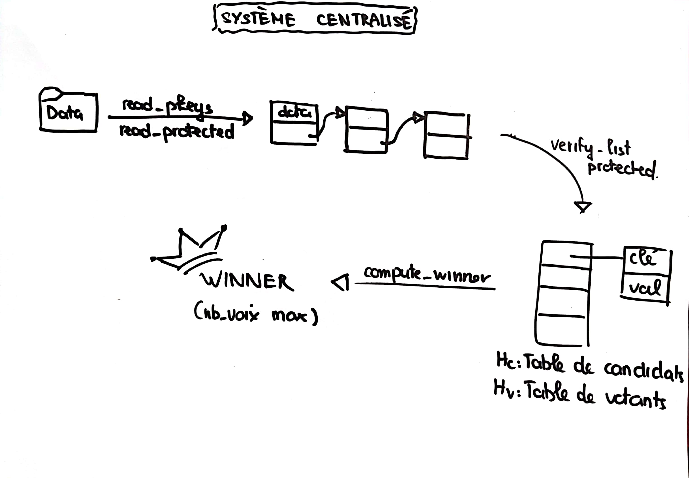
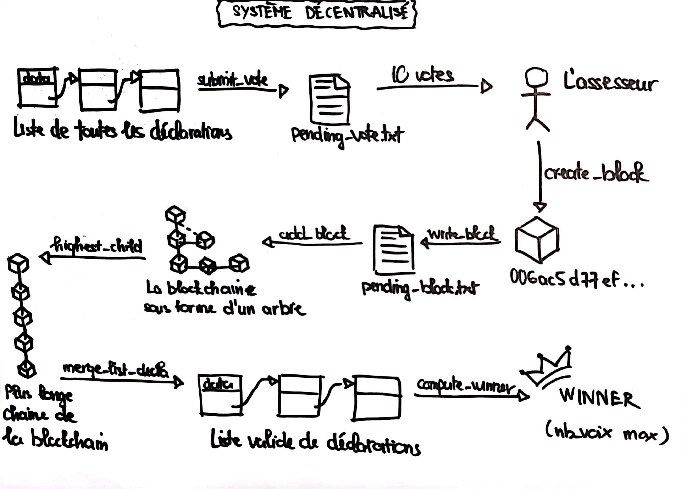

# Compte-rendu Projet Blockchain Appliquee a un Processus Electoral

## Sujet

>Le projet consiste a mettre en place un système électoral basée sur la blockchain.
Toutes les instructions relatives à l'utilisation du code se trouvent dans le README

[Github](https://github.com/agapestack/DS-03)

- **Partie 1**: Mise en place du RSA
- **Partie 2**: Implementation d'un systeme de vote (liste chainee, serialisation/deserialisation)
- **Partie 3**: Application du systeme de vote centralisee
- **Partie 4**: Mise en place des outils de la blockchain
- **Partie 5**: Application de la blockchain

## Description globale

[Diagramme Projet](./assets/Diagramme%20Projet.pdf)

## Fonctionnement du RSA

1. Le candidat met a disposition sa cle publique.
2. L'electeur chiffre la cle publique du candidat avec sa cle secrete (structure signature)
3. L'electeur fait sa declaration de vote contentant sa signature, sa cle publique et la cle publique du candidat (structure protected)
4. Pour verifier la declaration de vote on dechiffre la signature avec la cle publique de l'electeur et on compare la resultat avec la cle publique du candidat

<center></center>

## Fonctionnement du système de vote centralisée

1. L'electeur est enregistre sur les liste electoral puis il vote (emmet une declaration)
2. On recupere tous les votes depuis un fichier (ici declarations.txt) et on extrait toutes les declarations que l'on stocke sous forme d'une liste chainee
3. On verifie la validite du vote, s'il n'est pas valide on supprime la declaration de la liste chainee
4. On cree une table de hachage associee aux candidats et une autre associee aux electeurs, pour chaque declaration on verifie que le candidat existe bien dans notre liste de candidats et on verifie egalement que l'electeur n'a pas deja vote, et enfin si tout est valide on comptabilise le vote
5. On fait le decompte general et on declare le vainqueur de l'election

<center></center>

## Fonctionnement du système de vote décentralisée (blockchain)

1. L'electeur vote, sa declaration de vote est envoye sur le reseau (ici le reseau est represente pas l'ensemble des blocs, et les pending_blocks et pending_votes)
2. La declaration est mise en attente dans le fichier pending_votes. Lorsqu'un nombre suffisant de vote est atteint alors un assesseur va generer un bloc a partir de tous les votes en attentes
3. Le bloc va etre constitue d'une trace du dernier bloc auquel on fait confiance dans la blockchain, des declarations de votes ainsi que d'une preuve de travail. La preuve de travail est generee avec de la puissance de calcul en utilisant des outils cryptographique (ici c'est le hachage successif du bloc avec SHA-256 pour obtenir d 0 au debut).
4. Ensuite on verifie que la preuve de travail est conforme (verify_block dans le add_block) puis on ajoute le bloc a la blockchain
5. Une fois que la periode de vote est finis on recupere tous les blocs. On formera alors une arborescence a l'aide de ces derniers. On souhaite maintenant recupere les blocs valide c'est-a-dire les blocs faisant partie du plus long chemin de l'arborescence (le plus long chemin est celui qui a necessite le plus de calcul a cause des preuves de travail, on lui fait donc confiance, c'est la notion de consensus)
6. A partir de tous ces blocs on extrait toutes les declarations de vote et les mets dans une liste chaine puis comme pour le systeme centralisee on cree des tables de hachages, on verifie les votes et on declare le vainqueur

<center></center>

## Bugs et Problemes

- **Verification des signature dans les declarations de votes** (ex6)

>Nous obtennont des faux-positifs lors la verification des signatures. Le pourcentage d'erreurs varient selon les bornes des nombres premiers generees (≈0.5-6.6% de faux positifs), plus les nombres sont grands plus le pourcentage d'erreur est faible (une hypothese est que cela vient du test de primalite de miller-rabin).
Avec pour bornes 2^5 et 2^10 on a en moyenne 0.5% d'erreur et nous avons decider de continuer avec cela (en recodant tout le projet jusqu'a l'exercice 6 nous n'avons pas réussi a trouver la provenance de l'erreur)

- **Liberation de memoire au niveau des blocs** (ex9)

>Suite au changement impromptu du sujet au cours de la dernière semaine (ajout d'une fonction delete_block qui n'était pas la même que celle que nous avions réalisée de nous même) nous avons du créer des fonctions ayant la mention "v2" correspondant au sujet et cela nous a confus de l'exercice 7 à l'exercice 9 en terme de liberation de memoire. Il reste donc un probleme à ce niveau dans l'exercice 9 dans la dernière fonction (cependant le code fonctionne).

## Reponses aux questions

### 1.1 Complexite de is_prime_naive

>O(n): une boucle verifiant les diviseurs un a un.

### 1.2 Plus grand nombre premier en 2ms

```bash
Dernier nombre premier trouver en 2ms par is_prime_naive: 235813        temps=0.002212s
```

### 1.3 Complexite de modpow_naive

>Θ(m) car on a 2 opérations élémentaires (modulo et multiplication) m fois (la puissance)

### 1.5 Comparaison asymptotiques de modpow et modpow_naive

[comparaison des modpow](./assets/graphe_comparaison_exponentiation.pdf)

### 1.7 Borne superieur sur la probabilite d'erreur de l'algorithme de Miller/Rabin

>La probabilite d'erreur depend du nombre de tests realisés, si on ne fait qu'un test il y a 1/4 que le nombre teste soit pas un temoin de Miller et qu'on obtienne un faut positif. La probabilite d'erreur des donc de 1/(4^nb_test) et donc la probabilite pire-cas est 1/4.

### 7.8

>Pour des raisons de simplicité nous avons générer manuellement des données via l'exercice 4 pour lancer l'ex 7 pour mesurer les temps calculs de compute_proof_of_work puis avons générer un graphe avec les données obtennues et gnuplot. On obtient le graphe suivant: 

[compute_proof_of_work](./assets/compute_proof_of_work.pdf)

>On constate que la courbe a une forme exponentielle. Selon les paramètres de params.h, la puissance de l'ordinateur etc la valeur maximum de d obtennue en moins de 1s varie de 2 à 4.

### 8.8

>Fonction CellProtected **merge_list_decla(CellProtected **l1, CellProtected **l2)
La complexite depend de la longueur de la liste l1 (on definit curseur et on avance jusqu'au dernier element, puis on fait pointé l'element suivant du dernier element vers la tête de la liste l2). Avec n = longueur de l1 on a Θ(n).
Pour obtenir une complexite de O(1) on pourrait par exemple créer une autre structure contenant la tête et la queue de la liste chaînée, ainsi on pourrait acceder directement au dernier element d'une liste chaînée et le raccorder au premier element de l'autre liste.

### 9.7 Conclusion sur l'utilisation d'une blockchain dans un processus electoral

>L'utilisation d'une blockchain dans le cadre d'un processus de vote s'avère être intéressant en terme de transparence des élections. En effet chacun pourrait vérifier le décompte des voix et suivre l'avancé de l'élection. Cependant la notion de consensus consistant à faire confiance à la plus longue chaîne ne permet pas d'éviter toutes les fraudes car cela suppose qu'on fait confiance à la plus grande puissance de calcul. Or nous avons observé l'intervention d'état extérieur dans certaines élections, on peut donc imaginer qu'un autre état possédant d'important moyen informatique puisse générer une chaîne plus longue ce qui lui permettrait de modifier le résultat de l'élection. Le système que nous avons donc réaliser se révèle encore largement imparfait.
## Conclusion

>Projet particulièrement chronophage et un peu répétitif mais interessant dans le principe. Le language C se révèle à nouveau être un language se debuggant à base de printf et cela est assez ennuyeux (dommage car on pase plus de temps à printf qu'a manipuler les structures). Au final on a quand même bien mis en pratique les structures de données vu dans le cours et dans le td et c'etait le but.
