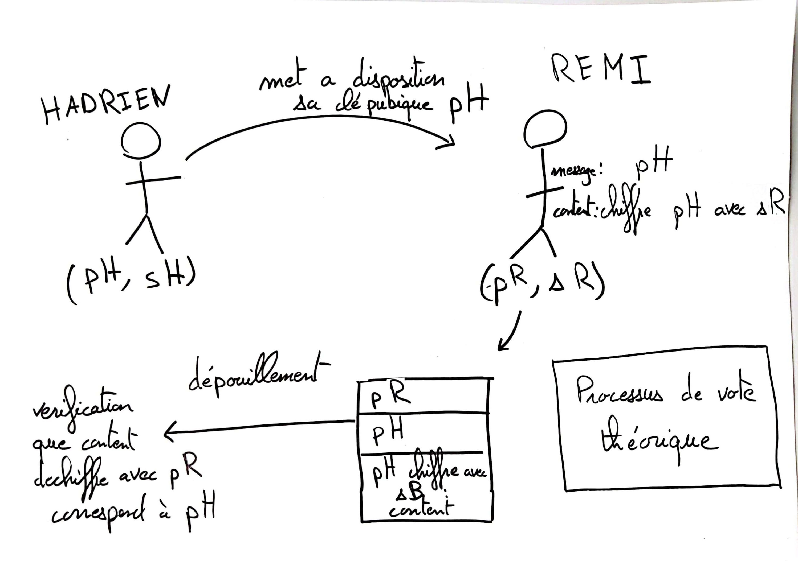

# Compte-rendu Projet Blockchain Appliquee a un Processus Electoral

## Sujet

>Le projet consiste a mettre en place le chiffrement RSA et un système de vote sécurisée.

[lien github](https://github.com/agapestack/DS-03)

**Partie 1**: Mise en place du RSA
**Partie 2**: Implementation du RSA avec les bases du systeme de vote (serialisation/deserialisation)
**Partie 3**: Application des listes chainees au system de vote centralisee
**Partie 4**: En cours
**Partie 5**: En cours

>De nombreux jeux de tests sont implementes dans les fichiers ex[num_ex].c (assert, strcmpt etc...)

## Description globale

[description globale](./assets/Diagramme_Projet.pdf)

## Description du systeme de vote

>Chaque citoyen participant a l'election en tant que candidat ou electeur se voit attribue une cle publique et une cle secrete.
Hadrien veut se presenter aux elections de mister france 2022, pour l'inscrire en tant que candidat on ajoute sa cle publique dans la liste des cles publiques des candidats.
Remi fervent admirateur d'Hadrien veut voter pour ce dernier. Pour cela, on va chiffrer la cle publique d'Hadrien avec sa cle secrete.
Ensuite lors du depouillement des resultats, on va dechiffrer la declaration de vote de Remi e l'aide de sa cle publique et comparer le resultat a la declaration de vote de Remi, si les deux correspondent alors le vote est valide, sinon le vote ne sera pas pris en compte.

<center></center>

## Reponses aux questions

### 1.1 Complexite de is_prime_naive

>O(n): une boucle verifiant les diviseurs un a un.

### 1.2 Plus grand nombre premier en 2ms

```bash
Dernier nombre premier trouver en 2ms par is_prime_naive: 235813        temps=0.002212s
```

### 1.3 Complexite de modpow_naive

>Θ(m) car on a 2 opérations élémentaires (modulo et multiplication) m fois (la puissance)

### 1.5 Comparaison asymptotiques de modpow et modpow_naive

[courbes obtennues](./assets/graphe_comparaison_exponentiation.pdf)

### 1.7 Borne superieur sur la probabilite d'erreur de l'algorithme de Miller/Rabin

>La probabilite d'erreur depend du nombre de test realiser, si on ne fait qu'un test il y a 1/4 que le nombre teste soit pas un temoin de Miller et qu'on obtienne un faut positif. La probabilite d'erreur des donc de 1/(4^nb_test) et donc la probabilite pire-cas est 1/4.

## Conclusion

